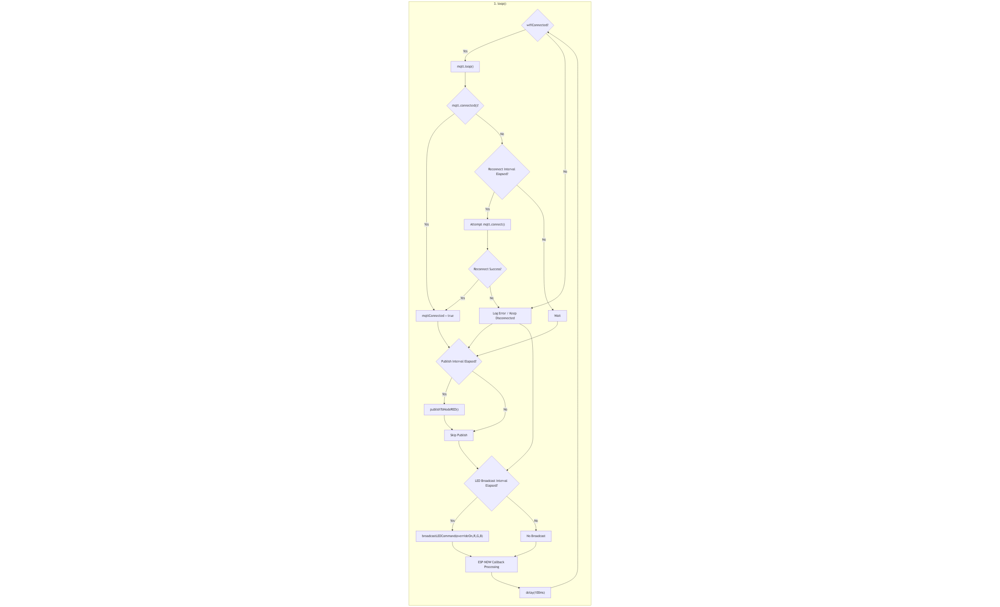



# Architecture

The architecture is split into the following parts:

- [Arduino Architecture]({{ site.baseurl }}/architecture/arduino/)
- [Node-RED Architecture]({{ site.baseurl }}/architecture/node/)

## Gateway Loop

The updated gateway control loop coordinates WiFi, MQTT connectivity, ESP-NOW data reception, periodic publishing, and LED override broadcasting.

Figure: Gateway main loop integrating MQTT reconnect logic, publish interval handling, and periodic LED override broadcasts to ESP-NOW nodes.

