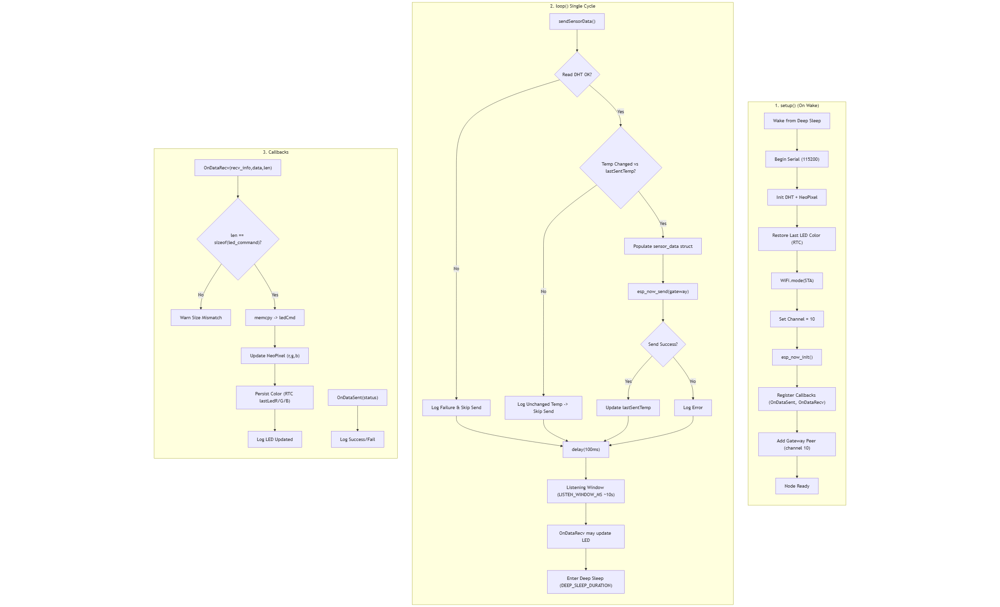



# Arduino Architecture

Arduino architecture is split into two parts: node and gateway.

The node activicty can be described by the flowchart below.

## Gateway Loop

The gateway control loop coordinates WiFi, MQTT connectivity, ESP-NOW data reception, periodic publishing, and LED override broadcasting.

